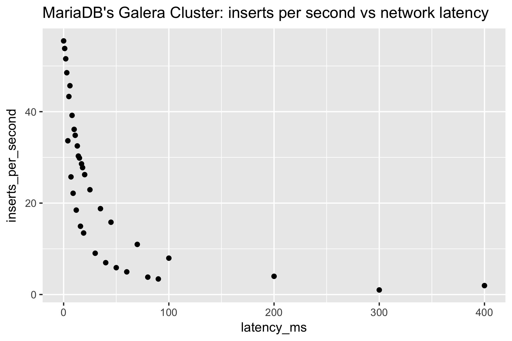

# MariaDB network latency benchmark

MariaDB has a multi-master database called [Galera Cluster](https://mariadb.com/kb/en/library/what-is-mariadb-galera-cluster/).

For our use case, the nodes of the cluster will be in different datacenters. When a record is written to MariaDB's Galera Cluster, it is replicated to all the nodes before an acknowlegement is made to the client. This is great for consistency, but not so great for throughput.

It was important for us to understand the relationship between network latency and throughput. If the network latency were to spike in one of the datacenters, what would happen how many writes could we perform from a single connection?

[Benjamin Cane](https://www.linkedin.com/in/bencane/) wrote a great [blog post](https://bencane.com/2012/07/16/tc-adding-simulated-network-latency-to-your-linux-server/) that explains how to simulate network latency using the Linux command `tc` (Traffic Control).

This project iteratively inserted records at various network latencies to understand the effect on throughput.

Here's a video walk-through:

